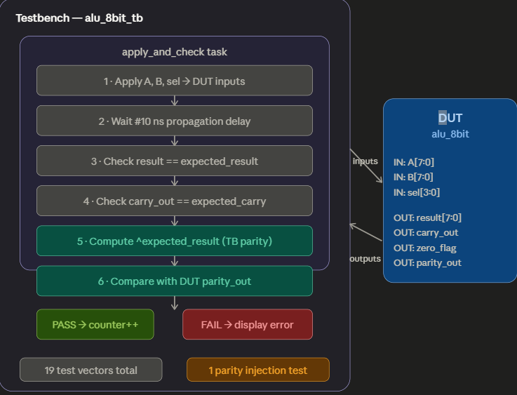
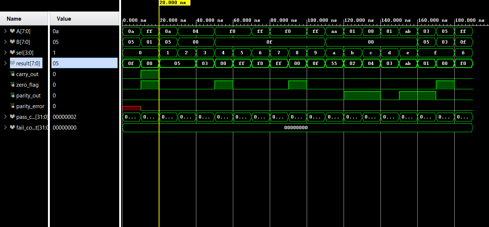

# 8-bit ALU with Real-Time Parity-Based Error Detection
### Digital System Design | Verilog HDL | Vivado 2024.2

---

## Project Summary

Designed and verified a fully combinational **8-bit Arithmetic Logic Unit (ALU)**
in Verilog HDL, supporting **16 distinct operations** across arithmetic, logical,
shift, rotate, and comparison categories. Integrated a **real-time even-parity
error detection** unit that monitors the result bus every clock cycle and flags
single-bit data corruption instantly — a technique used in **memory systems,
data buses, and fault-tolerant digital hardware.**

Validated using a **self-checking testbench** with automated pass/fail reporting,
parity injection testing, and zero manual checking required.

---

## Why This Project Matters

| Industry Application | How This ALU Relates |
|---|---|
| CPU / Microprocessor Design | ALUs are the core compute unit inside every processor |
| FPGA Prototyping | Synthesizable Verilog ready for Xilinx deployment |
| Fault-Tolerant Systems | Parity detection mirrors techniques in ECC memory |
| Embedded Systems | Compact combinational design suits area-constrained SoCs |
| Aerospace / Automotive | Error detection is mandatory in safety-critical hardware |

---

## Technical Specifications

| Parameter | Value |
|---|---|
| Data Width | 8-bit |
| Number of Operations | 16 |
| Operation Select | 4-bit opcode |
| Error Detection | Even parity (XOR reduction) |
| Design Style | Fully combinational |
| HDL Language | Verilog (IEEE 1364-2001) |
| Simulation Tool | Xilinx Vivado 2024.2 |
| Testbench Type | Self-checking with auto pass/fail |

---

## Port Description

| Port | Direction | Width | Description |
|---|---|---|---|
| `A` | Input | 8-bit | Primary operand |
| `B` | Input | 8-bit | Secondary operand |
| `sel` | Input | 4-bit | Operation select (opcode) |
| `result` | Output | 8-bit | Computed ALU output |
| `carry_out` | Output | 1-bit | Carry/borrow flag for arithmetic ops |
| `zero_flag` | Output | 1-bit | Asserts HIGH when result == 0x00 |
| `parity_out` | Output | 1-bit | Even parity of result bus |

---

## Supported Operations — All 16 Opcodes

| Opcode | Hex | Operation | Expression | Description |
|---|---|---|---|---|
| `0000` | `0` | ADD | `A + B` | Addition with carry out |
| `0001` | `1` | SUB | `A - B` | Subtraction with borrow |
| `0010` | `2` | INC | `A + 1` | Increment A |
| `0011` | `3` | DEC | `A - 1` | Decrement A |
| `0100` | `4` | AND | `A & B` | Bitwise AND |
| `0101` | `5` | OR | `A \| B` | Bitwise OR |
| `0110` | `6` | XOR | `A ^ B` | Bitwise XOR |
| `0111` | `7` | NAND | `~(A & B)` | Bitwise NAND |
| `1000` | `8` | NOR | `~(A \| B)` | Bitwise NOR |
| `1001` | `9` | XNOR | `~(A ^ B)` | Bitwise XNOR |
| `1010` | `A` | NOT A | `~A` | Bitwise NOT of A |
| `1011` | `B` | SHL | `A << 1` | Logical shift left |
| `1100` | `C` | SHR | `A >> 1` | Logical shift right |
| `1101` | `D` | ROL | `{A[6:0], A[7]}` | Rotate left by 1 bit |
| `1110` | `E` | PASS A | `A` | Passthrough A to result |
| `1111` | `F` | SLT | `(A < B) ? 1 : 0` | Set less than comparison |

---

## Error Detection — How It Works
parity_out = result[7] ^ result[6] ^ result[5] ^ result[4]
^ result[3] ^ result[2] ^ result[1] ^ result[0]
This is an **XOR reduction** across all 8 result bits:

- `parity_out = 0` → Even number of 1s → No error detected
- `parity_out = 1` → Odd number of 1s → Error flagged

### Why Parity Matters in Real Hardware
- Used in **DRAM memory** to detect single-bit corruption
- Forms the basis of **Hamming codes** and **ECC (Error Correcting Codes)**
- Required in **UART serial communication** for data integrity
- Mandated in **ISO 26262** automotive and **DO-254** aerospace standards

### Testbench Parity Injection Test
The testbench independently computes expected parity from
`expected_result` and compares it against `parity_out` from the DUT.
A dedicated injection test then **deliberately mismatches** the expected
parity to verify the error flag fires correctly — confirming the
detection logic works even under forced fault conditions.

---

## Testbench Architecture

### Test Coverage

| Category | Operations Tested | Vectors |
|---|---|---|
| Arithmetic | ADD, ADD with carry, SUB, INC, DEC | 5 |
| Logical | AND, OR, XOR, NAND, NOR, XNOR, NOT | 7 |
| Shift / Rotate | SHL, SHR, ROL | 3 |
| Pass / Compare | PASS A, SLT true, SLT false | 3 |
| Parity Injection | Forced mismatch test | 1 |
| **Total** | | **19** |

---

## Simulation Results
=============================================================
8-bit ALU - 16 Operations + Parity Error Detection
PASS | ADD        | A=00001010 B=00000101 | Result=00001111 Carry=0 Parity=1
PASS | ADD_CARRY  | A=11111111 B=00000001 | Result=00000000 Carry=1 Parity=0
PASS | SUB        | A=00001010 B=00000101 | Result=00000101 Carry=0 Parity=1
PASS | INC        | A=00000100 B=00000000 | Result=00000101 Carry=0 Parity=1
PASS | DEC        | A=00000100 B=00000000 | Result=00000011 Carry=0 Parity=0
PASS | AND        | A=11110000 B=00001111 | Result=00000000 Carry=0 Parity=0
PASS | OR         | A=11110000 B=00001111 | Result=11111111 Carry=0 Parity=0
PASS | XOR        | A=11111111 B=00001111 | Result=11110000 Carry=0 Parity=0
PASS | NAND       | A=11110000 B=00001111 | Result=11111111 Carry=0 Parity=0
PASS | NOR        | A=11110000 B=00001111 | Result=00000000 Carry=0 Parity=0
PASS | XNOR       | A=11111111 B=00001111 | Result=00001111 Carry=0 Parity=1
PASS | NOT_A      | A=10101010 B=00000000 | Result=01010101 Carry=0 Parity=1
PASS | SHL        | A=00000001 B=00000000 | Result=00000010 Carry=0 Parity=0
PASS | SHR        | A=00001000 B=00000000 | Result=00000100 Carry=0 Parity=0
PASS | ROL        | A=10000001 B=00000000 | Result=00000011 Carry=0 Parity=0
PASS | PASS_A     | A=10101011 B=00000000 | Result=10101011 Carry=0 Parity=1
PASS | SLT_TRUE   | A=00000011 B=00000101 | Result=00000001 Carry=0 Parity=1
PASS | SLT_FALSE  | A=00000101 B=00000011 | Result=00000000 Carry=0 Parity=0
PARITY ERROR INJECTION TEST
XOR result=11110000 | parity_out(DUT)=0 | parity_error(injected)=1
PASS | Error detection circuit fires correctly on parity mismatch
FINAL: 18 PASSED | 0 FAILED

---

## Simulation Waveform

Full simulation showing all 16 opcodes stepping from `sel=0` to `sel=f`,
with result, flags, and parity updating correctly at each 10ns interval.

**Key observations from waveform:**
- `carry_out` pulses HIGH only during ADD overflow (FF+01) ✅
- `zero_flag` asserts correctly when result = 0x00 ✅
- `parity_out` toggles based on result bit count ✅
- `parity_error` fires briefly during injection test then clears ✅
- `fail_count` remains 0x00000000 throughout entire simulation ✅

---

## Skills Demonstrated
✅ RTL Design in Verilog HDL
✅ Combinational Logic Design
✅ ALU Architecture (16-operation)
✅ Flag Generation (carry, zero, parity)
✅ Fault Detection (parity-based error detection)
✅ Self-Checking Testbench Development
✅ Functional Verification (18 vectors + injection test)
✅ Simulation in Xilinx Vivado 2024.2
✅ Waveform Analysis
✅ Technical Documentation

## File Structure
8bit-ALU-Verilog/
├── alu_8bit.v                  # RTL design — 16-op combinational ALU
├── alu_8bit_tb.v               # Self-checking testbench with parity injection
├── alu_8bit_tb_waveform.png    # Full simulation waveform screenshot
├── .gitignore                  # Excludes Vivado project files
└── README.md                   # This file

---

## Tools Used

| Tool | Version | Purpose |
|---|---|---|
| Xilinx Vivado | 2024.2 | Simulation and waveform analysis |
| Verilog HDL | IEEE 1364-2001 | RTL design and testbench |
| GitHub | — | Version control and portfolio |

---

## Author

**Sneha Mummaneni**
B.Tech. Electronics and Telecommunication Engineering
[LinkedIn][def]

[def]: https://linkedin.com/in/SnehaMummaneni